# Waffle Engine 🧇

Waffle Engine is my first custom game engine, built to support my 3D game **Biosector73**.  
Built in **Rust**, with **Lua scripting planned**.

Status: **Active development**

---

## Engine Roadmap

```mermaid
flowchart LR
    DONE["✅ DONE"]
    WIP["🚧 WIP"]
    UPC["⏳ UPCOMING"]

    DONE --> D1["Bloom 3D"]
    DONE --> D2["Fog"]
    DONE --> D3["Lighting"]
    DONE --> D4["Load GLTF"]
    DONE --> D5["PBR"]
    DONE --> D6["Tonemapping"]

    WIP --> W1["Atmosphere"]
    WIP --> W2["SSAO"]
    WIP --> W3["SSR"]
    WIP --> W4["Asset Loading"]
    WIP --> W5["Gizmos"]
    WIP --> W6["Picking"]

    UPC --> U1["2D Rendering"]
    UPC --> U2["Animation System"]
    UPC --> U3["UI System"]
    UPC --> U4["ECS Expansion"]
    UPC --> U5["Shaders"]
    UPC --> U6["Audio"]
    UPC --> U7["Tools"]
    UPC --> U8["Windowing"]
```

This diagram shows **exactly**:
- what already works
- what you're actively building
- what exists as planned scope

No clutter, no guessing.

---

## Examples Coverage (Full List)

<b>Click to expand the full list</b>

## Examples Coverage

Status key: `DONE`, `WIP`, `UPCOMING`.

1. [UPCOMING] 2d/2d shapes (2d/2d_shapes.rs)
1. [UPCOMING] 2d/2d viewport to world (2d/2d_viewport_to_world.rs)
1. [UPCOMING] 2d/Bloom 2d (2d/bloom_2d.rs)
1. [UPCOMING] 2d/Cpu draw (2d/cpu_draw.rs)
1. [UPCOMING] 2d/Custom gltf vertex attribute (2d/custom_gltf_vertex_attribute.rs)
1. [UPCOMING] 2d/Mesh2d (2d/mesh2d.rs)
1. [UPCOMING] 2d/Mesh2d alpha mode (2d/mesh2d_alpha_mode.rs)
1. [UPCOMING] 2d/Mesh2d arcs (2d/mesh2d_arcs.rs)
1. [UPCOMING] 2d/Mesh2d manual (2d/mesh2d_manual.rs)
1. [UPCOMING] 2d/Mesh2d repeated texture (2d/mesh2d_repeated_texture.rs)
1. [UPCOMING] 2d/Mesh2d vertex color texture (2d/mesh2d_vertex_color_texture.rs)
1. [UPCOMING] 2d/Move sprite (2d/move_sprite.rs)
1. [UPCOMING] 2d/Pixel grid snap (2d/pixel_grid_snap.rs)
1. [UPCOMING] 2d/Rotation (2d/rotation.rs)
1. [UPCOMING] 2d/Sprite (2d/sprite.rs)
1. [UPCOMING] 2d/Sprite animation (2d/sprite_animation.rs)
1. [UPCOMING] 2d/Sprite flipping (2d/sprite_flipping.rs)
1. [UPCOMING] 2d/Sprite scale (2d/sprite_scale.rs)
1. [UPCOMING] 2d/Sprite sheet (2d/sprite_sheet.rs)
1. [UPCOMING] 2d/Sprite slice (2d/sprite_slice.rs)
1. [UPCOMING] 2d/Sprite tile (2d/sprite_tile.rs)
1. [UPCOMING] 2d/Text2d (2d/text2d.rs)
1. [UPCOMING] 2d/Texture atlas (2d/texture_atlas.rs)
1. [UPCOMING] 2d/Tilemap chunk (2d/tilemap_chunk.rs)
1. [UPCOMING] 2d/Transparency 2d (2d/transparency_2d.rs)
1. [UPCOMING] 2d/Wireframe 2d (2d/wireframe_2d.rs)
1. [UPCOMING] 3d/3d scene (3d/3d_scene.rs)
1. [UPCOMING] 3d/3d shapes (3d/3d_shapes.rs)
1. [UPCOMING] 3d/3d viewport to world (3d/3d_viewport_to_world.rs)
1. [UPCOMING] 3d/Animated material (3d/animated_material.rs)
1. [UPCOMING] 3d/Anisotropy (3d/anisotropy.rs)
1. [UPCOMING] 3d/Anti aliasing (3d/anti_aliasing.rs)
1. [WIP] 3d/Atmosphere (3d/atmosphere.rs)
1. [UPCOMING] 3d/Atmospheric fog (3d/atmospheric_fog.rs)
1. [UPCOMING] 3d/Auto exposure (3d/auto_exposure.rs)
1. [UPCOMING] 3d/Blend modes (3d/blend_modes.rs)
1. [DONE] 3d/Bloom 3d (3d/bloom_3d.rs)
1. [UPCOMING] 3d/Camera sub view (3d/camera_sub_view.rs)
1. [UPCOMING] 3d/Clearcoat (3d/clearcoat.rs)
1. [UPCOMING] 3d/Clustered decals (3d/clustered_decals.rs)
1. [UPCOMING] 3d/Color grading (3d/color_grading.rs)
1. [UPCOMING] 3d/Decal (3d/decal.rs)
1. [UPCOMING] 3d/Deferred rendering (3d/deferred_rendering.rs)
1. [UPCOMING] 3d/Depth of field (3d/depth_of_field.rs)
1. [UPCOMING] 3d/Edit material on gltf (3d/edit_material_on_gltf.rs)
1. [DONE] 3d/Fog (3d/fog.rs)
1. [UPCOMING] 3d/Fog volumes (3d/fog_volumes.rs)
1. [UPCOMING] 3d/Generate custom mesh (3d/generate_custom_mesh.rs)
1. [UPCOMING] 3d/Irradiance volumes (3d/irradiance_volumes.rs)
1. [UPCOMING] 3d/Light textures (3d/light_textures.rs)
1. [DONE] 3d/Lighting (3d/lighting.rs)
1. [UPCOMING] 3d/Lightmaps (3d/lightmaps.rs)
1. [UPCOMING] 3d/Lines (3d/lines.rs)
1. [DONE] 3d/Load gltf (3d/load_gltf.rs)
1. [UPCOMING] 3d/Load gltf extras (3d/load_gltf_extras.rs)
1. [UPCOMING] 3d/Manual material (3d/manual_material.rs)
1. [UPCOMING] 3d/Mesh ray cast (3d/mesh_ray_cast.rs)
1. [UPCOMING] 3d/Meshlet (3d/meshlet.rs)
1. [UPCOMING] 3d/Mixed lighting (3d/mixed_lighting.rs)
1. [UPCOMING] 3d/Motion blur (3d/motion_blur.rs)
1. [UPCOMING] 3d/Occlusion culling (3d/occlusion_culling.rs)
1. [UPCOMING] 3d/Order independent transparency (3d/order_independent_transparency.rs)
1. [UPCOMING] 3d/Orthographic (3d/orthographic.rs)
1. [UPCOMING] 3d/Parallax mapping (3d/parallax_mapping.rs)
1. [UPCOMING] 3d/Parenting (3d/parenting.rs)
1. [DONE] 3d/Pbr (3d/pbr.rs)
1. [UPCOMING] 3d/Pcss (3d/pcss.rs)
1. [UPCOMING] 3d/Post processing (3d/post_processing.rs)
1. [UPCOMING] 3d/Query gltf primitives (3d/query_gltf_primitives.rs)
1. [UPCOMING] 3d/Reflection probes (3d/reflection_probes.rs)
1. [UPCOMING] 3d/Render to texture (3d/render_to_texture.rs)
1. [UPCOMING] 3d/Rotate environment map (3d/rotate_environment_map.rs)
1. [UPCOMING] 3d/Scrolling fog (3d/scrolling_fog.rs)
1. [UPCOMING] 3d/Shadow biases (3d/shadow_biases.rs)
1. [UPCOMING] 3d/Shadow caster receiver (3d/shadow_caster_receiver.rs)
1. [UPCOMING] 3d/Skybox (3d/skybox.rs)
1. [UPCOMING] 3d/Solari (3d/solari.rs)
1. [UPCOMING] 3d/Specular tint (3d/specular_tint.rs)
1. [UPCOMING] 3d/Spherical area lights (3d/spherical_area_lights.rs)
1. [UPCOMING] 3d/Split screen (3d/split_screen.rs)
1. [UPCOMING] 3d/Spotlight (3d/spotlight.rs)
1. [WIP] 3d/Ssao (3d/ssao.rs)
1. [WIP] 3d/Ssr (3d/ssr.rs)
1. [UPCOMING] 3d/Texture (3d/texture.rs)
1. [DONE] 3d/Tonemapping (3d/tonemapping.rs)
1. [UPCOMING] 3d/Transmission (3d/transmission.rs)
1. [UPCOMING] 3d/Transparency 3d (3d/transparency_3d.rs)
1. [UPCOMING] 3d/Two passes (3d/two_passes.rs)
1. [UPCOMING] 3d/Update gltf scene (3d/update_gltf_scene.rs)
1. [UPCOMING] 3d/Vertex colors (3d/vertex_colors.rs)
1. [UPCOMING] 3d/Visibility range (3d/visibility_range.rs)
1. [UPCOMING] 3d/Volumetric fog (3d/volumetric_fog.rs)
1. [UPCOMING] 3d/Wireframe (3d/wireframe.rs)
1. [UPCOMING] animation/Animated mesh (animation/animated_mesh.rs)
1. [UPCOMING] animation/Animated mesh control (animation/animated_mesh_control.rs)
1. [UPCOMING] animation/Animated mesh events (animation/animated_mesh_events.rs)
1. [UPCOMING] animation/Animated transform (animation/animated_transform.rs)
1. [UPCOMING] animation/Animated ui (animation/animated_ui.rs)
1. [UPCOMING] animation/Animation events (animation/animation_events.rs)
1. [UPCOMING] animation/Animation graph (animation/animation_graph.rs)
1. [UPCOMING] animation/Animation masks (animation/animation_masks.rs)
1. [UPCOMING] animation/Color animation (animation/color_animation.rs)
1. [UPCOMING] animation/Custom skinned mesh (animation/custom_skinned_mesh.rs)
1. [UPCOMING] animation/Eased motion (animation/eased_motion.rs)
1. [UPCOMING] animation/Easing functions (animation/easing_functions.rs)
1. [UPCOMING] animation/Gltf skinned mesh (animation/gltf_skinned_mesh.rs)
1. [UPCOMING] animation/Morph targets (animation/morph_targets.rs)
1. [UPCOMING] app/Custom loop (app/custom_loop.rs)
1. [UPCOMING] app/Drag and drop (app/drag_and_drop.rs)
1. [UPCOMING] app/Empty (app/empty.rs)
1. [UPCOMING] app/Empty defaults (app/empty_defaults.rs)
1. [UPCOMING] app/Headless (app/headless.rs)
1. [UPCOMING] app/Headless renderer (app/headless_renderer.rs)
1. [UPCOMING] app/Log layers (app/log_layers.rs)
1. [UPCOMING] app/Log layers ecs (app/log_layers_ecs.rs)
1. [UPCOMING] app/Logs (app/logs.rs)
1. [UPCOMING] app/No renderer (app/no_renderer.rs)
1. [UPCOMING] app/Plugin (app/plugin.rs)
1. [UPCOMING] app/Plugin group (app/plugin_group.rs)
1. [UPCOMING] app/Return after run (app/return_after_run.rs)
1. [UPCOMING] app/Thread pool resources (app/thread_pool_resources.rs)
1. [UPCOMING] app/Without winit (app/without_winit.rs)
1. [UPCOMING] asset/Alter mesh (asset/alter_mesh.rs)
1. [UPCOMING] asset/Alter sprite (asset/alter_sprite.rs)
1. [UPCOMING] asset/Asset decompression (asset/asset_decompression.rs)
1. [WIP] asset/Asset loading (asset/asset_loading.rs)
1. [UPCOMING] asset/Asset settings (asset/asset_settings.rs)
1. [UPCOMING] asset/Custom asset (asset/custom_asset.rs)
1. [UPCOMING] asset/Custom asset reader (asset/custom_asset_reader.rs)
1. [UPCOMING] asset/Embedded asset (asset/embedded_asset.rs)
1. [UPCOMING] asset/Extra source (asset/extra_source.rs)
1. [UPCOMING] asset/Hot asset reloading (asset/hot_asset_reloading.rs)
1. [UPCOMING] asset/Multi asset sync (asset/multi_asset_sync.rs)
1. [UPCOMING] asset/processing/Asset processing (asset/processing/asset_processing.rs)
1. [UPCOMING] asset/Repeated texture (asset/repeated_texture.rs)
1. [UPCOMING] asset/Web asset (asset/web_asset.rs)
1. [UPCOMING] async_tasks/Async compute (async_tasks/async_compute.rs)
1. [UPCOMING] async_tasks/External source external thread (async_tasks/external_source_external_thread.rs)
1. [UPCOMING] audio/Audio (audio/audio.rs)
1. [UPCOMING] audio/Audio control (audio/audio_control.rs)
1. [UPCOMING] audio/Decodable (audio/decodable.rs)
1. [UPCOMING] audio/Pitch (audio/pitch.rs)
1. [UPCOMING] audio/Soundtrack (audio/soundtrack.rs)
1. [UPCOMING] audio/Spatial audio 2d (audio/spatial_audio_2d.rs)
1. [UPCOMING] audio/Spatial audio 3d (audio/spatial_audio_3d.rs)
1. [UPCOMING] camera/2d on ui (camera/2d_on_ui.rs)
1. [UPCOMING] camera/2d screen shake (camera/2d_screen_shake.rs)
1. [UPCOMING] camera/2d top down camera (camera/2d_top_down_camera.rs)
1. [UPCOMING] camera/Camera orbit (camera/camera_orbit.rs)
1. [UPCOMING] camera/Custom projection (camera/custom_projection.rs)
1. [UPCOMING] camera/First person view model (camera/first_person_view_model.rs)
1. [UPCOMING] camera/Projection zoom (camera/projection_zoom.rs)
1. [UPCOMING] dev_tools/Fps overlay (dev_tools/fps_overlay.rs)
1. [UPCOMING] diagnostics/Custom diagnostic (diagnostics/custom_diagnostic.rs)
1. [UPCOMING] diagnostics/Enabling disabling diagnostic (diagnostics/enabling_disabling_diagnostic.rs)
1. [UPCOMING] diagnostics/Log diagnostics (diagnostics/log_diagnostics.rs)
1. [UPCOMING] ecs/Change detection (ecs/change_detection.rs)
1. [UPCOMING] ecs/Component hooks (ecs/component_hooks.rs)
1. [UPCOMING] ecs/Custom query param (ecs/custom_query_param.rs)
1. [UPCOMING] ecs/Custom schedule (ecs/custom_schedule.rs)
1. [UPCOMING] ecs/Dynamic (ecs/dynamic.rs)
1. [UPCOMING] ecs/Ecs guide (ecs/ecs_guide.rs)
1. [UPCOMING] ecs/Entity disabling (ecs/entity_disabling.rs)
1. [UPCOMING] ecs/Error handling (ecs/error_handling.rs)
1. [UPCOMING] ecs/Fallible params (ecs/fallible_params.rs)
1. [UPCOMING] ecs/Fixed timestep (ecs/fixed_timestep.rs)
1. [UPCOMING] ecs/Generic system (ecs/generic_system.rs)
1. [UPCOMING] ecs/Hierarchy (ecs/hierarchy.rs)
1. [UPCOMING] ecs/Hotpatching systems (ecs/hotpatching_systems.rs)
1. [UPCOMING] ecs/Immutable components (ecs/immutable_components.rs)
1. [UPCOMING] ecs/Iter combinations (ecs/iter_combinations.rs)
1. [UPCOMING] ecs/Message (ecs/message.rs)
1. [UPCOMING] ecs/Nondeterministic system order (ecs/nondeterministic_system_order.rs)
1. [UPCOMING] ecs/Observer propagation (ecs/observer_propagation.rs)
1. [UPCOMING] ecs/Observers (ecs/observers.rs)
1. [UPCOMING] ecs/One shot systems (ecs/one_shot_systems.rs)
1. [UPCOMING] ecs/Parallel query (ecs/parallel_query.rs)
1. [UPCOMING] ecs/Relationships (ecs/relationships.rs)
1. [UPCOMING] ecs/Removal detection (ecs/removal_detection.rs)
1. [UPCOMING] ecs/Run conditions (ecs/run_conditions.rs)
1. [UPCOMING] ecs/Send and receive messages (ecs/send_and_receive_messages.rs)
1. [UPCOMING] ecs/Startup system (ecs/startup_system.rs)
1. [UPCOMING] ecs/State scoped (ecs/state_scoped.rs)
1. [UPCOMING] ecs/System closure (ecs/system_closure.rs)
1. [UPCOMING] ecs/System param (ecs/system_param.rs)
1. [UPCOMING] ecs/System piping (ecs/system_piping.rs)
1. [UPCOMING] ecs/System stepping (ecs/system_stepping.rs)
1. [UPCOMING] games/Alien cake addict (games/alien_cake_addict.rs)
1. [UPCOMING] games/Breakout (games/breakout.rs)
1. [UPCOMING] games/Contributors (games/contributors.rs)
1. [UPCOMING] games/Desk toy (games/desk_toy.rs)
1. [UPCOMING] games/Game menu (games/game_menu.rs)
1. [UPCOMING] games/Loading screen (games/loading_screen.rs)
1. [UPCOMING] games/Stepping (games/stepping.rs)
1. [UPCOMING] gizmos/2d gizmos (gizmos/2d_gizmos.rs)
1. [WIP] gizmos/3d gizmos (gizmos/3d_gizmos.rs)
1. [WIP] gizmos/Axes (gizmos/axes.rs)
1. [UPCOMING] gizmos/Light gizmos (gizmos/light_gizmos.rs)
1. [UPCOMING] root/Hello world (hello_world.rs)
1. [UPCOMING] helpers/Camera controller (helpers/camera_controller.rs)
1. [UPCOMING] helpers/Widgets (helpers/widgets.rs)
1. [UPCOMING] input/Char input events (input/char_input_events.rs)
1. [UPCOMING] input/Gamepad input (input/gamepad_input.rs)
1. [UPCOMING] input/Gamepad input events (input/gamepad_input_events.rs)
1. [UPCOMING] input/Gamepad rumble (input/gamepad_rumble.rs)
1. [UPCOMING] input/Keyboard input (input/keyboard_input.rs)
1. [UPCOMING] input/Keyboard input events (input/keyboard_input_events.rs)
1. [UPCOMING] input/Keyboard modifiers (input/keyboard_modifiers.rs)
1. [UPCOMING] input/Mouse grab (input/mouse_grab.rs)
1. [UPCOMING] input/Mouse input (input/mouse_input.rs)
1. [UPCOMING] input/Mouse input events (input/mouse_input_events.rs)
1. [UPCOMING] input/Text input (input/text_input.rs)
1. [UPCOMING] input/Touch input (input/touch_input.rs)
1. [UPCOMING] input/Touch input events (input/touch_input_events.rs)
1. [UPCOMING] math/Bounding 2d (math/bounding_2d.rs)
1. [UPCOMING] math/Cubic splines (math/cubic_splines.rs)
1. [UPCOMING] math/Custom primitives (math/custom_primitives.rs)
1. [UPCOMING] math/Random sampling (math/random_sampling.rs)
1. [UPCOMING] math/Render primitives (math/render_primitives.rs)
1. [UPCOMING] math/Sampling primitives (math/sampling_primitives.rs)
1. [UPCOMING] mobile/src/Lib (mobile/src/lib.rs)
1. [UPCOMING] mobile/src/Main (mobile/src/main.rs)
1. [UPCOMING] movement/Physics in fixed timestep (movement/physics_in_fixed_timestep.rs)
1. [UPCOMING] movement/Smooth follow (movement/smooth_follow.rs)
1. [UPCOMING] no_std/library/src/Lib (no_std/library/src/lib.rs)
1. [UPCOMING] picking/Debug picking (picking/debug_picking.rs)
1. [WIP] picking/Mesh picking (picking/mesh_picking.rs)
1. [UPCOMING] picking/Simple picking (picking/simple_picking.rs)
1. [UPCOMING] picking/Sprite picking (picking/sprite_picking.rs)
1. [UPCOMING] reflection/auto_register_static/src/bin/Main (reflection/auto_register_static/src/bin/main.rs)
1. [UPCOMING] reflection/auto_register_static/src/Lib (reflection/auto_register_static/src/lib.rs)
1. [UPCOMING] reflection/Custom attributes (reflection/custom_attributes.rs)
1. [UPCOMING] reflection/Dynamic types (reflection/dynamic_types.rs)
1. [UPCOMING] reflection/Function reflection (reflection/function_reflection.rs)
1. [UPCOMING] reflection/Generic reflection (reflection/generic_reflection.rs)
1. [UPCOMING] reflection/Reflection (reflection/reflection.rs)
1. [UPCOMING] reflection/Reflection types (reflection/reflection_types.rs)
1. [UPCOMING] reflection/Serialization (reflection/serialization.rs)
1. [UPCOMING] reflection/Type data (reflection/type_data.rs)
1. [UPCOMING] remote/Client (remote/client.rs)
1. [UPCOMING] remote/Server (remote/server.rs)
1. [UPCOMING] scene/Scene (scene/scene.rs)
1. [UPCOMING] shader/Animate shader (shader/animate_shader.rs)
1. [UPCOMING] shader/Array texture (shader/array_texture.rs)
1. [UPCOMING] shader/Automatic instancing (shader/automatic_instancing.rs)
1. [UPCOMING] shader/Compute shader game of life (shader/compute_shader_game_of_life.rs)
1. [UPCOMING] shader/Extended material (shader/extended_material.rs)
1. [UPCOMING] shader/Extended material bindless (shader/extended_material_bindless.rs)
1. [UPCOMING] shader/Fallback image (shader/fallback_image.rs)
1. [UPCOMING] shader/Gpu readback (shader/gpu_readback.rs)
1. [UPCOMING] shader/Shader defs (shader/shader_defs.rs)
1. [UPCOMING] shader/Shader material (shader/shader_material.rs)
1. [UPCOMING] shader/Shader material 2d (shader/shader_material_2d.rs)
1. [UPCOMING] shader/Shader material bindless (shader/shader_material_bindless.rs)
1. [UPCOMING] shader/Shader material glsl (shader/shader_material_glsl.rs)
1. [UPCOMING] shader/Shader material screenspace texture (shader/shader_material_screenspace_texture.rs)
1. [UPCOMING] shader/Shader material wesl (shader/shader_material_wesl.rs)
1. [UPCOMING] shader/Shader prepass (shader/shader_prepass.rs)
1. [UPCOMING] shader/Storage buffer (shader/storage_buffer.rs)
1. [UPCOMING] shader_advanced/Custom phase item (shader_advanced/custom_phase_item.rs)
1. [UPCOMING] shader_advanced/Custom post processing (shader_advanced/custom_post_processing.rs)
1. [UPCOMING] shader_advanced/Custom render phase (shader_advanced/custom_render_phase.rs)
1. [UPCOMING] shader_advanced/Custom shader instancing (shader_advanced/custom_shader_instancing.rs)
1. [UPCOMING] shader_advanced/Custom vertex attribute (shader_advanced/custom_vertex_attribute.rs)
1. [UPCOMING] shader_advanced/Render depth to texture (shader_advanced/render_depth_to_texture.rs)
1. [UPCOMING] shader_advanced/Specialized mesh pipeline (shader_advanced/specialized_mesh_pipeline.rs)
1. [UPCOMING] shader_advanced/Texture binding array (shader_advanced/texture_binding_array.rs)
1. [UPCOMING] state/Computed states (state/computed_states.rs)
1. [UPCOMING] state/Custom transitions (state/custom_transitions.rs)
1. [UPCOMING] state/States (state/states.rs)
1. [UPCOMING] state/Sub states (state/sub_states.rs)
1. [UPCOMING] stress_tests/Bevymark (stress_tests/bevymark.rs)
1. [UPCOMING] stress_tests/Many animated sprites (stress_tests/many_animated_sprites.rs)
1. [UPCOMING] stress_tests/Many buttons (stress_tests/many_buttons.rs)
1. [UPCOMING] stress_tests/Many cameras lights (stress_tests/many_cameras_lights.rs)
1. [UPCOMING] stress_tests/Many components (stress_tests/many_components.rs)
1. [UPCOMING] stress_tests/Many cubes (stress_tests/many_cubes.rs)
1. [UPCOMING] stress_tests/Many foxes (stress_tests/many_foxes.rs)
1. [UPCOMING] stress_tests/Many gizmos (stress_tests/many_gizmos.rs)
1. [UPCOMING] stress_tests/Many glyphs (stress_tests/many_glyphs.rs)
1. [UPCOMING] stress_tests/Many gradients (stress_tests/many_gradients.rs)
1. [UPCOMING] stress_tests/Many lights (stress_tests/many_lights.rs)
1. [UPCOMING] stress_tests/Many materials (stress_tests/many_materials.rs)
1. [UPCOMING] stress_tests/Many sprites (stress_tests/many_sprites.rs)
1. [UPCOMING] stress_tests/Many text2d (stress_tests/many_text2d.rs)
1. [UPCOMING] stress_tests/Text pipeline (stress_tests/text_pipeline.rs)
1. [UPCOMING] stress_tests/Transform hierarchy (stress_tests/transform_hierarchy.rs)
1. [UPCOMING] testbed/2d (testbed/2d.rs)
1. [UPCOMING] testbed/3d (testbed/3d.rs)
1. [UPCOMING] testbed/Full ui (testbed/full_ui.rs)
1. [UPCOMING] testbed/Helpers (testbed/helpers.rs)
1. [UPCOMING] testbed/Ui (testbed/ui.rs)
1. [UPCOMING] time/Time (time/time.rs)
1. [UPCOMING] time/Timers (time/timers.rs)
1. [UPCOMING] time/Virtual time (time/virtual_time.rs)
1. [UPCOMING] tools/Gamepad viewer (tools/gamepad_viewer.rs)
1. [UPCOMING] tools/scene_viewer/Animation plugin (tools/scene_viewer/animation_plugin.rs)
1. [UPCOMING] tools/scene_viewer/Main (tools/scene_viewer/main.rs)
1. [UPCOMING] tools/scene_viewer/Morph viewer plugin (tools/scene_viewer/morph_viewer_plugin.rs)
1. [UPCOMING] tools/scene_viewer/Scene viewer plugin (tools/scene_viewer/scene_viewer_plugin.rs)
1. [UPCOMING] transforms/3d rotation (transforms/3d_rotation.rs)
1. [UPCOMING] transforms/Align (transforms/align.rs)
1. [UPCOMING] transforms/Scale (transforms/scale.rs)
1. [UPCOMING] transforms/Transform (transforms/transform.rs)
1. [UPCOMING] transforms/Translation (transforms/translation.rs)
1. [UPCOMING] ui/Borders (ui/borders.rs)
1. [UPCOMING] ui/Box shadow (ui/box_shadow.rs)
1. [UPCOMING] ui/Button (ui/button.rs)
1. [UPCOMING] ui/Directional navigation (ui/directional_navigation.rs)
1. [UPCOMING] ui/Display and visibility (ui/display_and_visibility.rs)
1. [UPCOMING] ui/Drag to scroll (ui/drag_to_scroll.rs)
1. [UPCOMING] ui/Feathers (ui/feathers.rs)
1. [UPCOMING] ui/Flex layout (ui/flex_layout.rs)
1. [UPCOMING] ui/Font atlas debug (ui/font_atlas_debug.rs)
1. [UPCOMING] ui/Ghost nodes (ui/ghost_nodes.rs)
1. [UPCOMING] ui/Gradients (ui/gradients.rs)
1. [UPCOMING] ui/Grid (ui/grid.rs)
1. [UPCOMING] ui/Overflow (ui/overflow.rs)
1. [UPCOMING] ui/Overflow clip margin (ui/overflow_clip_margin.rs)
1. [UPCOMING] ui/Overflow debug (ui/overflow_debug.rs)
1. [UPCOMING] ui/Relative cursor position (ui/relative_cursor_position.rs)
1. [UPCOMING] ui/Render ui to texture (ui/render_ui_to_texture.rs)
1. [UPCOMING] ui/Scroll (ui/scroll.rs)
1. [UPCOMING] ui/Scrollbars (ui/scrollbars.rs)
1. [UPCOMING] ui/Size constraints (ui/size_constraints.rs)
1. [UPCOMING] ui/Stacked gradients (ui/stacked_gradients.rs)
1. [UPCOMING] ui/Standard widgets (ui/standard_widgets.rs)
1. [UPCOMING] ui/Standard widgets observers (ui/standard_widgets_observers.rs)
1. [UPCOMING] ui/Tab navigation (ui/tab_navigation.rs)
1. [UPCOMING] ui/Text (ui/text.rs)
1. [UPCOMING] ui/Text background colors (ui/text_background_colors.rs)
1. [UPCOMING] ui/Text debug (ui/text_debug.rs)
1. [UPCOMING] ui/Text wrap debug (ui/text_wrap_debug.rs)
1. [UPCOMING] ui/Transparency ui (ui/transparency_ui.rs)
1. [UPCOMING] ui/Ui drag and drop (ui/ui_drag_and_drop.rs)
1. [UPCOMING] ui/Ui material (ui/ui_material.rs)
1. [UPCOMING] ui/Ui scaling (ui/ui_scaling.rs)
1. [UPCOMING] ui/Ui target camera (ui/ui_target_camera.rs)
1. [UPCOMING] ui/Ui texture atlas (ui/ui_texture_atlas.rs)
1. [UPCOMING] ui/Ui texture atlas slice (ui/ui_texture_atlas_slice.rs)
1. [UPCOMING] ui/Ui texture slice (ui/ui_texture_slice.rs)
1. [UPCOMING] ui/Ui texture slice flip and tile (ui/ui_texture_slice_flip_and_tile.rs)
1. [UPCOMING] ui/Ui transform (ui/ui_transform.rs)
1. [UPCOMING] ui/Viewport debug (ui/viewport_debug.rs)
1. [UPCOMING] ui/Viewport node (ui/viewport_node.rs)
1. [UPCOMING] ui/Virtual keyboard (ui/virtual_keyboard.rs)
1. [UPCOMING] ui/Window fallthrough (ui/window_fallthrough.rs)
1. [UPCOMING] ui/Z index (ui/z_index.rs)
1. [UPCOMING] usage/Context menu (usage/context_menu.rs)
1. [UPCOMING] usage/Cooldown (usage/cooldown.rs)
1. [UPCOMING] window/Clear color (window/clear_color.rs)
1. [UPCOMING] window/Custom cursor image (window/custom_cursor_image.rs)
1. [UPCOMING] window/Custom user event (window/custom_user_event.rs)
1. [UPCOMING] window/Low power (window/low_power.rs)
1. [UPCOMING] window/Monitor info (window/monitor_info.rs)
1. [UPCOMING] window/Multi window text (window/multi_window_text.rs)
1. [UPCOMING] window/Multiple windows (window/multiple_windows.rs)
1. [UPCOMING] window/Scale factor override (window/scale_factor_override.rs)
1. [UPCOMING] window/Screenshot (window/screenshot.rs)
1. [UPCOMING] window/Transparent window (window/transparent_window.rs)
1. [UPCOMING] window/Window drag move (window/window_drag_move.rs)
1. [UPCOMING] window/Window resizing (window/window_resizing.rs)
1. [UPCOMING] window/Window settings (window/window_settings.rs)

